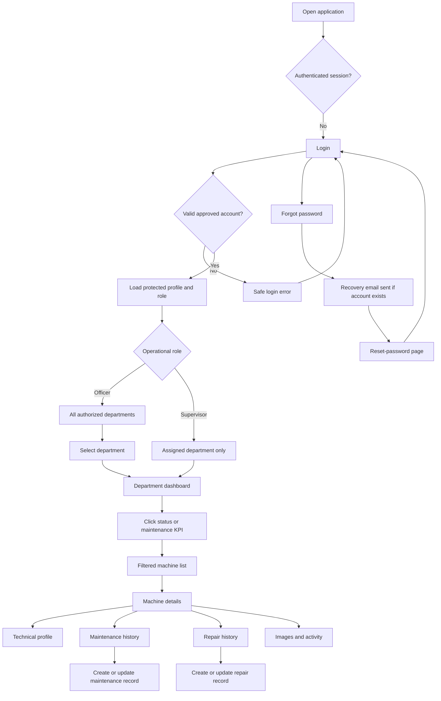
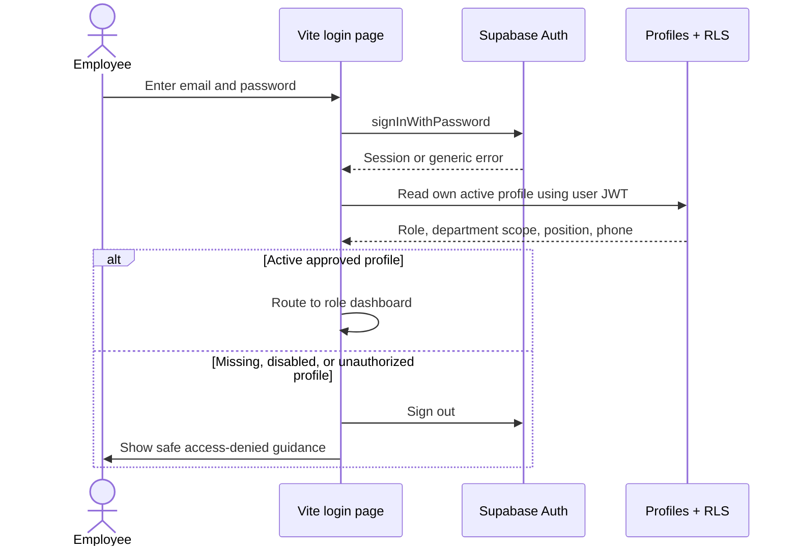
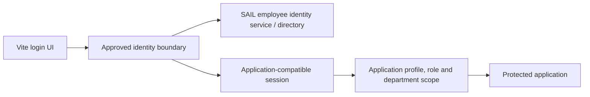
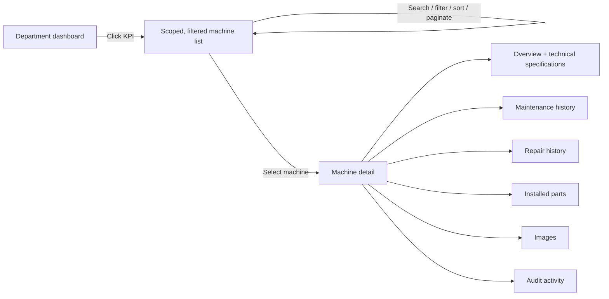
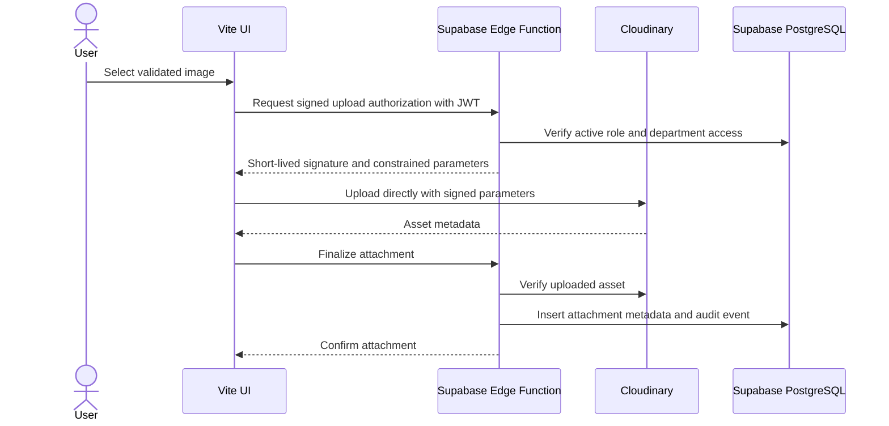

# Plant Maintenance System — Product and User Flow

> This document owns user journeys and screen-to-screen behavior. Architecture and security belong in `plan.md`; implementation progress belongs in `phases.md`. It does not authorize backend work.

## 1. Purpose and precedence

This document defines the intended navigation and data flow for:

- controlled employee login and password recovery;
- role-specific Officer and Supervisor dashboards;
- department selection and department-scoped asset visibility;
- dashboard KPI drill-down to machine lists and machine history;
- machine technical specifications and maintenance updates;
- persistent user identity details throughout the authenticated application;
- the later transition from initial Supabase users to SAIL BSP's authoritative employee identity source;
- secure Cloudinary-backed machine and repair images.

Read this file when implementing navigation, role-specific experiences, or workflow states. If it conflicts with `.agents/plan.md`, the plan controls durable requirements and security; `.agents/phases.md` controls sequencing.

## 2. External context reviewed

SAIL's published Bhilai Steel Plant facilities page describes BSP as an integrated plant spanning
coke ovens and coal chemicals, sinter plants, blast furnaces, steel melting shops with continuous
casting, rolling mills, and auxiliary units such as power, oxygen, refractory materials, foundry
and engineering shops, and slag granulation. This supports a configurable department-first
hierarchy.

On 2026-07-26 the user directed that the department fixtures be derived from that page. The
resulting 21 departments in `mock-data.ts` are therefore **provisional and clearly labelled as
such**: the page lists *production facilities*, not BSP's internal maintenance department master.
Codes such as SP3, CHM, and Coke Ovens come from the user directly. Official codes, names, display
order, active state, and department heads still require sign-off, and `head` values are invented
placeholders.

Names, codes, ordering, active state, and Officer access must remain data-driven.

## 3. End-to-end application flow

## 4. Authentication flow

### 4.1 Initial authentication source: Supabase Auth

During the approved backend phase, the first production-like version uses Supabase email/password Auth. Gmail addresses are normal emails, not Google OAuth. Public registration and in-app user administration remain absent. A project operator provisions approved identities and linked profiles outside the application; employees use the recovery flow to establish or reset passwords.

The login journey succeeds only when both the Auth session and an active, authorized application profile are valid. Provisioning details, RLS rules, secret handling, and role-assignment security are defined in `.agents/plan.md` sections 13–15.

### 4.2 Login page behavior

The existing two-panel visual design should be retained and polished.

Required states and controls:

- email field;
- password field with accessible show/hide control;
- sign-in button with loading state and duplicate-submit prevention;
- **Forgot password?** link;
- generic invalid-credentials response that does not reveal account existence;
- session-expired and disabled-account guidance;
- no public sign-up or Google sign-in button;
- safe retry behavior and basic rate-limit messaging;
- redirect back to the originally requested permitted page when appropriate.

Do not label seeded production users or display their credentials on the final login screen. Demo-account shortcuts may exist only in explicit development builds. No application user can create another account or assign a role.

### 4.3 Forgot/reset password flow

Interpret “forward password” as **forgot password/password reset**.

1. A newly provisioned user or an existing user selects **Forgot password?** from login, or **Reset password** from the authenticated account menu/profile.
2. User enters their email address.
3. The UI requests a Supabase recovery email using an allowlisted application redirect URL.
4. The response remains generic whether or not the account exists.
5. The recovery link returns to a dedicated `/reset-password` route.
6. The page validates the recovery session and accepts a new password plus confirmation.
7. On success, other sessions should be revoked where the chosen policy supports it, and the user returns to login. For a newly seeded identity, this establishes the employee's first usable password.
8. Expired, reused, malformed, and missing-token states must be designed.

Production recovery emails require an approved SMTP configuration, sender identity, redirect allowlist, and SAIL-approved copy. Do not depend on Supabase's limited default mail service for employees.

### 4.4 Later authoritative SAIL employee authentication

The later employee database must be treated as an external identity authority, not as a frontend database connection.

Security requirements for this transition:

- Never query the employee credential database directly from the browser.
- Never copy, log, expose, or synchronize employee plaintext passwords.
- Confirm what the “different database” actually provides: direct database access, an authentication API, LDAP/Active Directory, or an enterprise identity provider.
- Prefer an approved SAIL identity provider or authentication API over direct credential-table access.
- Keep application roles, department assignments, active state, and audit data in protected application tables unless SAIL designates an authoritative source for them.
- Complete a separate threat model, privacy review, network design, session design, account-linking plan, and cutover/rollback plan before integration.
- Decide whether Supabase Auth remains the session issuer, is federated with the SAIL identity source, or is replaced. Do not assume Supabase email/password can directly validate an arbitrary external password database.
- Define stable employee identifiers so email changes do not create duplicate accounts or lose history.
- During cutover, map each approved employee identity to exactly one application profile and revoke obsolete seeded accounts.

The login page can preserve its visual design through this transition, but its backend contract must be isolated behind an authentication service interface.

## 5. User identity shown throughout the application

Every authenticated route must use the shared application shell. The header/account area must show:

- email address;
- phone number;
- department or “Multiple departments” for a broadly scoped Officer;
- position/designation;
- application role: Officer or Supervisor;
- account menu with Profile, Reset password, and Logout.

On narrow screens, a compact identity summary may be shown in the header with full details in the account drawer. Do not repeatedly fetch the same profile on every page; load and cache the authenticated profile at the application boundary, then refresh it after approved changes.

Profile rules:

- users may view their identity information;
- role, department assignment, position, active state, and employee identifier are controlled roster/project-operator data and are not editable in the application;
- whether users may edit their phone number requires confirmation;
- the interface must not offer role or department self-assignment;
- sensitive authorization changes must generate audit events.

## 6. Role and department flow

### 6.1 Officer

After login, the Officer lands on a department-selection dashboard.

- Show all departments the Officer is authorized to access, initially expected to be about 20.
- Each department card shows its code/name and a small summary such as total machines, due, overdue, under maintenance, and under repair.
- Provide search when the full department list is available.
- Selecting a department sets an explicit current-department context and opens that department dashboard.
- The current department must remain visible in the page title/breadcrumb and must be carried into machine, maintenance, repair, and report filters.
- Provide a clear **Change department** action.
- Do not combine records across departments unless the Officer explicitly chooses a future “All departments” view.

### 6.2 Supervisor

After login, the Supervisor lands directly on the dashboard for their assigned department.

- The department name/code must be prominent in the top bar and page heading.
- No department picker is shown when only one department is assigned.
- All list, count, search, maintenance, repair, image, and report queries are restricted to the assigned department by RLS, not only by UI filters.
- If multi-department Supervisor assignments are later required, this is a schema and flow change requiring approval.

### 6.3 Roles in scope

Officer and Supervisor are the only application roles. The Viewer role was removed from product
scope on 2026-07-25 and deleted from the frontend. Any future read-only or audit role is a new
product decision, not a revival of Viewer.

## 7. Department dashboard

The Officer's selected-department dashboard and the Supervisor's assigned-department dashboard share one component and one data contract.

Required dashboard context:

- current department name and code;
- logged-in user identity summary;
- last refreshed time;
- deterministic reporting date/timezone;
- clear loading, empty, error, and permission-denied states.

Required KPI cards:

- total machines;
- active machines;
- inactive machines;
- machines under maintenance;
- machines under repair;
- retired machines;
- maintenance due soon;
- overdue maintenance;
- optionally scheduled/in-progress/completed maintenance counts once terminology is confirmed.

Every count must be actionable where a corresponding list exists.

| Dashboard action  | Destination                                                         |
| ----------------- | ------------------------------------------------------------------- |
| Active machines   | Machine register filtered by department + `active`                  |
| Inactive machines | Machine register filtered by department + `inactive`                |
| Under maintenance | Machine register filtered by department + `under_maintenance`       |
| Under repair      | Machine register filtered by department + `under_repair`            |
| Retired           | Machine register filtered by department + `retired`                 |
| Due soon          | Maintenance/machine list filtered by due window                     |
| Overdue           | Maintenance/machine list filtered to due date before reporting date |
| Recent repair row | Repair detail or associated machine Repairs tab                     |

Filters must be reflected in the URL so refresh/back navigation preserves the drill-down. Counts and destination lists must use the same definitions and department scope.

## 8. Machine list and detail flow

Machine list requirements:

- preserve the selected/assigned department scope;
- show the active dashboard filter as a removable filter chip;
- support server-ready search, filters, deterministic sorting, and pagination;
- never load all machines into the browser once Supabase is connected;
- show machine code, name, status, location, next maintenance date, and due state;
- clicking a row/card opens the machine detail without losing return context.

Machine detail requirements:

- machine identity and current effective status;
- department and physical location;
- technical specification profile;
- maintenance schedule/current due state;
- complete maintenance and repair history;
- parts, images, and audit activity;
- role-appropriate actions with server/RLS enforcement later.

## 9. Machine technical specification profile

The specification profile is **versioned and audited** (confirmed 2026-07-26). Officers and
Supervisors may both change it; every change records actor, timestamp, and reason. Maintenance
records describe work performed against a machine and never silently overwrite its specification.

Values and units are stored separately. Never persist `"20 ton/hour"` in one column: keep a
PostgreSQL `numeric` value plus a constrained unit.

### Field set aligned to current industry practice

The user's original list is a subset of the standard belt-conveyor data sheet. CEMA-aligned
practice specifies belt width and speed together with capacity, because width and speed are
interchangeable for a given tonnage. Bearing housings are identified by manufacturer designation
rather than a free-text size: SKF SNL/SE split plummer block housings follow ISO 113 boundary
dimensions and are ordered by shaft bore, for example `SNL 522-619` for a 100 mm shaft.

| Group          | Fields                                                                                                          | Unit                       |
| -------------- | --------------------------------------------------------------------------------------------------------------- | -------------------------- |
| Duty           | Design capacity; material conveyed; bulk density; maximum lump size                                              | `t/h`; text; `t/m³`; `mm`  |
| Belt           | Belt width; belt speed; carcass/ply type; belt thickness; top and bottom cover thickness; trough and surcharge angle | `mm`; `m/s`; text; `mm`; `°` |
| Geometry       | Conveyor length; lift or elevation; incline angle                                                                | `m`; `m`; `°`              |
| Drive motor    | Rated power; voltage; speed; frame size; IP rating; insulation class; starting method                             | `kW`; `V`; `rpm`; text     |
| Gearbox        | Type; reduction ratio; rated torque; service factor; lubricant grade                                             | text; ratio; `kNm`; text   |
| Pulleys        | Drive, tail, drive snub, tail snub, drive bend, tail bend, and take-up/gravity: diameter, face width, shaft diameter, lagging type and thickness | `mm`; text             |
| Bearings       | Plummer block housing designation; bearing designation; shaft bore diameter; housing number                       | text; text; `mm`; text     |
| Idlers         | Roll diameter; carry and return pitch; idler type                                                                | `mm`; `mm`; text           |
| Take-up        | Take-up type; take-up travel                                                                                     | text; `mm`                 |
| Safety         | Brake or backstop type; holdback fitted                                                                          | text; boolean              |

Units above follow standard practice and supersede the earlier provisional set, but each allowed
range and the plant's preferred unit per field still need engineering sign-off before the schema
freeze. `plumber block` is confirmed to mean **plummer block**.

Proposed edit authority:

- Officer: machine master data and the specification profile.
- Supervisor: maintenance and repair records, and audited specification changes.

## 10. Maintenance update flow

1. User opens a machine's Maintenance tab or starts from the department maintenance list.
2. Existing schedule, due state, and chronological history are shown.
3. Authorized Officer/Supervisor selects **Add maintenance record** or edits an allowed draft/in-progress record.
4. Form captures maintenance type/status, dates, work performed, parts replaced, findings, actions, performed by, remarks, and accepted scheduling fields.
5. The machine technical profile appears read-only for context unless the separate specification-change permission is granted.
6. Server validation checks department scope, allowed status transition, dates, role, and machine state.
7. The write and associated audit/status effects occur atomically.
8. Dashboard counts, machine due state, and history are invalidated/refreshed together.

Machine status must be derived or changed through one authoritative operation. Completing maintenance must not leave a machine permanently marked `under_maintenance`; open repairs must still take precedence according to the accepted status rules.

## 11. Images and Cloudinary flow

Cloudinary will hold machine and repair images only after the backend phase is approved. Supabase stores attachment metadata, associations, ownership, and lifecycle state; it never stores image binaries.

Rules:

- machine images: main image plus additional gallery images;
- repair images: evidence associated with one repair and its machine;
- use organized folders such as `plant-maintenance/machines/<machine-id>` and `plant-maintenance/repairs/<repair-id>`;
- validate MIME type, extension, bytes, dimensions, count, and ownership;
- signatures, secret-bearing operations, deletion, replacement, cleanup, and privileged reconciliation run in authenticated Edge Functions;
- Cloudinary API secret and Supabase service-role credentials never enter `VITE_*`, the frontend bundle, logs, or responses;
- finalize only verified uploads and clean up failed/unfinalized assets;
- use pending/deleting/failed lifecycle states and retryable reconciliation to avoid orphaned assets;
- deleting an attachment is an authorized, audited workflow that removes the Cloudinary asset and reconciles the database record.

The inspected local configuration files contain connection/key material and are gitignored. Their values must never be copied into this document or committed. No remote asset or Cloudinary folder was created while preparing this flow.

## 12. Data-contract ownership

This flow describes what users see and do. Canonical entities, stored-versus-derived fields, database relationships, and environment variables belong in `.agents/plan.md`. Accepted frontend contracts and implementation evidence belong in `.agents/phases.md`.

## 13. Authorization ownership

Role descriptions here define expected UX. Supabase RLS, grants, profile protection, department predicates, service-role limits, and Edge Function authorization are defined in `.agents/plan.md`; frontend controls never replace those controls.

## 14. Sequence ownership

This document does not schedule work. `.agents/phases.md` is the only implementation sequence and progress tracker. The frontend acceptance gate must pass before backend work begins.

## 15. Acceptance scenarios

### Officer scenario

- Officer signs in with an approved account.
- Header shows email, phone, role, position, and multi-department scope.
- Officer selects SP3 (fixture until official master is provided).
- Dashboard shows only SP3 counts.
- Officer clicks **Under maintenance** and sees the matching SP3 machine list.
- Officer opens a machine, reviews its technical profile and history, and performs an allowed update.
- Returning to the dashboard shows consistent mock counts during frontend review and consistent persisted counts after backend integration.

### Supervisor scenario

- Supervisor signs in and is routed directly to the assigned department.
- The department is prominent in the header; no unrelated department is selectable.
- Every list and KPI contains only assigned-department data.
- Supervisor can add/update maintenance and repair records but cannot edit machine master/specification fields under the proposed permission model.
- Direct navigation to another department is rejected by RLS after backend integration.

### Password recovery scenario

- User requests reset from login or profile.
- UI does not reveal whether an email exists.
- Valid recovery link reaches `/reset-password` and allows a policy-compliant new password.
- Expired/invalid links receive safe recovery guidance.
- User can sign in with the new password and sees the correct profile/role scope.

### Image scenario

- Authorized user uploads a valid machine or repair image.
- Unauthorized role, wrong department, excessive size, wrong type, and expired signature are rejected.
- Successful upload creates verified metadata and an audit event.
- Replacement/deletion updates Cloudinary and Supabase without leaving an untracked asset.

## 16. Decisions requiring confirmation

1. Confirm the official department master. Fixtures now model 21 departments from SAIL's published BSP facilities page; official codes, names, display order, active state, and heads still need sign-off.
2. Confirm official position/designation values.
3. Confirm the later SAIL identity source type and its technical owner; do not share passwords or production credentials in chat or Git.
5. Confirm whether the future identity integration is federation, an authentication API, or a controlled account migration.
6. Confirm who will act as the Supabase project operator for the one-time known-email bootstrap and later offboarding; this is an operational responsibility, not an application account.
7. Confirm the secure roster format and whether newly bootstrapped users should receive a recovery email automatically or initiate **Forgot password** themselves.
8. Confirm production SMTP ownership, sender domain, recovery URLs, password policy, session lifetime, and revocation behavior.

### Resolved on 2026-07-27

- **Supervisor report exports:** permitted. A Supervisor may export any report they may read, which
  is their own department only. Cross-department reports stay Officer-only, so export authority
  never widens department scope.

### Resolved on 2026-07-26 (Phase 4)

- **Maintenance status transitions:** linear plus reopen — `scheduled → in_progress → completed`,
  cancel from `scheduled`/`in_progress`, and an audited reopen from `completed` back to
  `in_progress`.
- **Effective machine status:** derived from open maintenance/repair records, never a separate
  stored field. The last open record's completion or cancellation returns the machine to `active`.
- **Maintenance frequency:** interval-based — every N days/weeks/months/years from last
  completion, not a calendar rule.
- **Cost fields:** removed. Maintenance and repair records carry no cost, currency, or budget
  field.

### Resolved on 2026-07-26

- **Officer department breadth:** associated departments only. No all-departments dashboard.
- **Supervisor departments:** exactly one, their assigned department.
- **Department context:** survives logout and is restored on next sign-in.
- **Profile editability:** users may edit neither phone nor email. Both are roster-controlled.
- **Supervisor specification authority:** Supervisors may change machine specifications, recorded as an audited specification change.
- **Specification model:** versioned and audited, per the section 9 recommendation.
- **Due-soon window:** 15 days, defined once in `src/lib/maintenance-window.ts`.
- **Password reset:** fully designed now, with a real `/reset-password` route.
- **Notification centre:** a real feature, not a decorative badge.
- **Image rules:** JPEG/JPG, PNG, and AVIF at up to 5 MB. **One image per installed part and one per machine**; uploading replaces the existing image. Officer and Supervisor may both add and replace. Cloudinary storage via Edge Functions once the backend phase begins.
- **Serial-number uniqueness:** enforced for machines and parts.

### Resolved on 2026-07-25

- **Viewer role:** removed from product scope. Section 6.3 records the outcome.
- **Specification units:** the section 9 defaults are adopted **provisionally** — capacity `t/h`,
  motor `kW`, drum and pulley diameter/width `mm`. Engineering must still confirm each unit,
  allowed range, and the `plummer block` terminology before the schema freeze. Until then, treat
  every unit in section 9 as a working assumption, not a settled contract.
- **Parts semantics:** installed machine parts only, not stock inventory.
