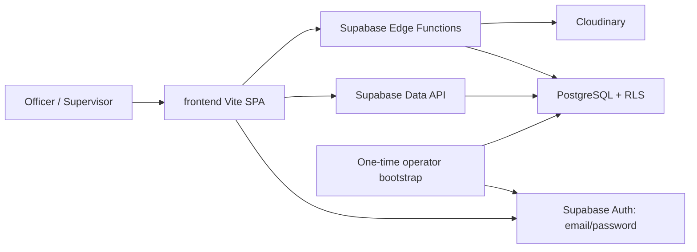

# Plant Maintenance and Machine Asset Register — Development Plan

> Revised 2026-07-25. This document owns durable product, architecture, data, and security decisions. Implementation progress and verification evidence belong only in `.agents/phases.md`.

## 1. Current direction

The active application is the standalone frontend in `frontend/`. Its existing UI structure and industrial design are the product baseline. Work will proceed in this order:

1. Complete every frontend page and route with realistic mock data.
2. Polish the complete UI across desktop and mobile.
3. Freeze frontend data contracts and obtain human acceptance.
4. Only then design and migrate the Supabase database.
5. Replace mock authentication/data with Supabase Auth/PostgreSQL/RLS.
6. Integrate Cloudinary through Supabase Edge Functions.
7. Test, secure, and deploy.

Do not connect to Supabase, read credential files, create migrations, upload Cloudinary assets, or begin backend integration until the user explicitly starts the backend phase.

## 2. Repository architecture

`frontend/` is a standalone application with no nested Git repository. The outer repository on `main` is the only Git worktree.

Detected stack:

- React 19.1 and React DOM 19.1.
- Vite 7.3 and TypeScript 5.9.
- Tailwind CSS 4 with a strong CSS-variable theme in `src/index.css`.
- Wouter for routing.
- shadcn/ui components built on Radix UI.
- TanStack Query provider, although there are currently no query/mutation consumers.
- Recharts, Sonner, Lucide, React Hook Form, date-fns, and Zod packages.
- pnpm with a lockfile.
- Static Vercel configuration with an SPA fallback.
- ESLint, Prettier, Vitest, and React Testing Library added during Phase 1.
- A typed in-memory repository used during frontend completion.

The repository is a single full-stack codebase, not two independently deployed application repositories:

```text
.
├── frontend/       # Active Vite SPA
├── supabase/         # Added only after frontend acceptance
│   ├── migrations/
│   └── functions/
└── .agents/          # Plan, roadmap, and product flow
```

There is no separate Express, FastAPI, or Next.js backend. Supabase PostgreSQL, Auth, RLS, and Edge Functions provide backend capabilities after the frontend acceptance gate.

## 3. Routing and implementation boundaries

Wouter remains the frontend router. Static routes such as `/machines/add` and `/machines/:id/edit` must be registered before `/machines/:id`. Every sidebar, header, dashboard, and detail action must resolve to an intentional page or be visibly disabled.

Stable route groups:

- Authentication: login, password recovery/reset, unauthorized access.
- Dashboard and profile.
- Machines: register, add, detail, edit.
- Parts management.
- Maintenance: list/history and create/update flows.
- Repairs: list/history and create/update flows.
- Reports center.
- Intentional not-found fallback.

Exact registered routes, completed work, deferred items, and test evidence are volatile implementation state; `.agents/phases.md` is their sole source of truth.

## 4. Product scope

### Frontend completion scope — immediate

- Finish machine create/edit workflows.
- Build complete parts, maintenance, repairs, and reports pages.
- Complete machine detail parts, images, and activity tabs.
- Make all forms behave realistically against an in-memory/mock repository without claiming persistence.
- Add loading, empty, error, confirmation, success, and validation states.
- Polish dashboard, authentication, profile, navigation, responsive layouts, accessibility, typography, spacing, forms, tables, cards, and feedback.
- Establish frontend tests and data contracts that later drive the schema.

### Backend integration scope — later, after UI acceptance

- Supabase email/password authentication.
- Officer and Supervisor profiles and RLS.
- PostgreSQL schema, migrations, generated types, auditability, due-date calculations, search, pagination, dashboard aggregates, and report-ready queries.
- Cloudinary machine/repair images through authenticated Supabase Edge Functions.
- Deployment environments, secrets, database tests, and security review.

### Out of scope unless separately approved

- Frontend framework migration or a separate Express/FastAPI backend.
- Google OAuth or public self-registration.
- IoT telemetry, purchasing, native mobile apps, multi-tenancy, and final PDF/Excel report generation.
- Reading or using root credential files before explicit authorization.
- Deleting the legacy root `frontend/` directory during page completion.

## 5. Frontend design principles

Preserve the existing visual identity:

- Deep industrial blue/navy palette, restrained status colors, Inter typography, compact radii, subtle borders/shadows, and clear data hierarchy.
- Existing `AppShell`, `Sidebar`, `Header`, `SailLogo`, shared components, shadcn primitives, machine table/mobile cards, dashboard visual language, and responsive behavior.
- Wouter routes and current navigation names unless the user approves a product change.

Polish rules:

- Prefer reuse and composition over replacing components.
- Keep consistent page widths, headers, breadcrumbs, section spacing, form grids, action placement, table density, and empty/loading/error states.
- Make pages usable at mobile, tablet, standard desktop, and wide desktop sizes.
- Use semantic landmarks, labels, keyboard navigation, visible focus, adequate contrast, and accessible dialogs/forms/charts.
- Avoid fake success. During the UI phase, explicitly label mock/in-memory behavior and update the temporary mock store when an action is presented as successful.
- Avoid introducing backend-shaped abstractions before page fields and workflows stabilize.

## 6. Frontend page requirements

### Application shell and navigation

- Correct route matching and add every linked route.
- Keep responsive sidebar/drawer, active states, breadcrumbs, account menu, and logout placement.
- Replace broken links with real pages; no primary navigation item may lead to 404.
- Add route-level loading/error patterns and permission-aware preview behavior.
- Decide whether notifications are a real UI page/menu or remove the false unread indicator during frontend acceptance.

### Authentication pages

- Keep the two-panel login design; improve validation, password visibility accessibility, errors, loading, and mobile layout.
- Retain demo login only during frontend development and clearly identify it as mock.
- Complete forgot-password success/error/resend states and add a reset-password screen if it is part of accepted UI scope.
- Gmail will later be used as a normal email address; no Google OAuth UI.

### Dashboard

- Preserve cards, charts, attention list, upcoming maintenance, and quick actions.
- Use one consistent mock-data source rather than separate hard-coded department data.
- Add meaningful empty/loading/error variants and accessible chart summaries.
- Ensure every quick action points to a real completed page.
- Confirm the due-soon label/value and report/dashboard terminology before data contracts freeze.

### Machine register and forms

- Preserve responsive table/cards, filters, sorting, search, pagination, and role-specific actions.
- Add machine create/edit pages using shared form sections: identity, department/type, manufacturer/model/serial, capacity, installation, location, status, description, and image placeholder.
- Add client validation, unsaved-change handling, cancel/back behavior, duplicate-code mock validation, and success/error states.
- Archive/retire rather than permanently delete historical machines.

### Machine detail

- Complete Overview, Parts, Maintenance, Repairs, Images, and Activity tabs.
- Display realistic technical/location fields already represented by `Machine`.
- Reuse domain tables/cards within tabs rather than leaving navigation-only placeholders.
- Show main/additional image gallery UI and mock uploader states without real Cloudinary calls.
- Present audit/activity timeline from mock events, not hard-coded page text.

### Parts management

- Decide whether this is installed parts, stock inventory, or both before finalizing fields.
- Build search/filter/sort/pagination, stock summary cards, list/table, part detail or drawer, add/edit/archive/restock flows, low/out-of-stock states, and machine association.
- Reuse the existing `MachinePart` fixture initially, but revise its contract only through an explicit frontend decision.

### Maintenance management

- Build schedule/list/history views with search, machine/type/status/date/due filters and pagination.
- Add log/schedule/edit/complete/cancel flows with work, findings, actions, technician, dates, duration, parts, remarks, and recurrence UI. No cost field — see decision table row "Maintenance/repair cost fields".
- Clarify the distinction between maintenance plans and performed records in the UI.
- Show due-soon and overdue states consistently across maintenance, machine detail, and dashboard.

### Repair management

- Build repair list/history with machine/status/date/downtime filters and pagination.
- Add report/edit/status-transition/complete/cancel forms with problem, diagnosis, action/resolution, dates, assignee, parts, downtime, remarks, and image evidence UI. No cost field — see decision table row "Maintenance/repair cost fields".
- Represent allowed statuses: reported, in progress, waiting for parts, completed, cancelled.

### Reports center

- Build report cards and filter panels for machine register, department assets, maintenance history, due/overdue, repair history, downtime, and machine parts.
- Provide preview/table states and mock export affordances clearly labeled non-functional until backend report data exists.
- Do not implement final PDF/Excel generation during frontend completion.

### Profile, access, and system states

- Polish profile layout and validation; make mock save/password behavior honest.
- Keep unauthorized/not-found pages consistent with the shell and navigation strategy.
- Remove the duplicate unused not-found page after confirming imports.

## 7. Temporary frontend data strategy

Keep mock data during page completion, but isolate it behind typed functions/hooks so pages do not mutate imported arrays directly. A small in-memory repository/context may support create/edit/archive and status transitions for realistic UI testing. It must be clearly temporary and easy to replace.

Frontend contracts to freeze after UI acceptance:

- `UserProfile` and role/permission fields.
- `Department`.
- `Machine` and location/technical fields.
- `MachinePart` and inventory semantics.
- Maintenance plan and maintenance record distinction.
- `RepairRecord` and status transitions.
- `Attachment` metadata.
- `AuditLog` event shape.
- Dashboard and report filter/result DTOs.

Do not design PostgreSQL tables merely by copying denormalized display fields such as `machineName` or `department` into child rows. The later schema will normalize relationships and map rows into accepted UI DTOs.

## 8. Frontend permissions during the mock phase

| Capability                                                     | Officer |           Supervisor |
| -------------------------------------------------------------- | ------: | -------------------: |
| View machines, parts, maintenance, repairs, dashboard, reports |     Yes |                  Yes |
| Add/edit/archive/retire machine master data                    |     Yes |                   No |
| Add/edit/archive installed parts                               |     Yes |                  Yes |
| Add/update maintenance and repairs                             |     Yes |                  Yes |
| Define maintenance plans                                       |     Yes |                  Yes |
| Change machine specifications (audited)                        |     Yes |                  Yes |
| View archived records                                          |     Yes |                   No |
| Add/remove image UI entries                                    |     Yes |                  Yes |
| Export report data                                             |     Yes |                  Yes |
| Change assigned role                                           |      No |                   No |

There is no Viewer role: it was removed from product scope on 2026-07-25. Officer and Supervisor
are the only application roles.

Mock permissions exist only to validate UX. Later, Supabase RLS and Edge Function checks are authoritative.

## 9. Frontend quality strategy

- Use the established ESLint and Prettier scripts without mass-reformatting unrelated generated UI components.
- Use Vitest and React Testing Library for permissions, routes, forms, filters, pagination, dialogs, empty/error states, and mock repository behavior.
- Add Playwright after pages stabilize for critical navigation and role workflows.
- Replace touched `any` types with explicit props/unions.
- Keep strict typechecking; consider enabling full `strict`/`strictFunctionTypes` after measuring migration impact.
- Check production Vite build, SPA fallback, bundle warnings, console errors, accessibility, and responsive layouts after every page phase.
- Capture accepted screenshots before backend integration so later data work cannot silently regress UI.

## 10. Frontend acceptance checkpoint

Backend work cannot begin until all of the following are true:

- Every sidebar/header/quick-action link resolves to an intentional page.
- Machine add/edit, parts, maintenance, repairs, and reports pages are complete with mock data.
- Machine detail has no placeholder tab.
- Forms have accepted fields, validation, loading/success/error/cancel behavior.
- Officer and Supervisor UI behavior is accepted.
- Mobile/tablet/desktop layouts and keyboard/accessibility checks pass.
- No fake persistence is presented as production behavior.
- Frontend contracts and workflow/status decisions are documented.
- Typecheck, lint, unit/component tests, relevant E2E, and production build pass.
- The user explicitly approves beginning Supabase schema work.

Completion of these criteria is tracked only in `.agents/phases.md` Phase 7.

## 11. Later Supabase architecture

After the acceptance checkpoint, the Vite SPA will use a browser Supabase client with only the project URL and publishable key. Normal reads and user-authorized mutations will use the authenticated user JWT and PostgreSQL RLS. Supabase Edge Functions will be narrow privileged boundaries for Cloudinary signatures/finalization/deletion, reconciliation, and operations requiring secret keys. The application will not have an Admin role, Admin account, Admin dashboard, or in-app user-management feature.



The bootstrap is an out-of-band deployment/project-owner operation, not an application user role. It creates the approved Auth identities and matching protected profiles from a non-committed roster. Do not route ordinary CRUD through a service-role Edge Function. Data API grants and RLS are separate controls and both must be explicit.

## 12. Later database proposal

The final schema must be revalidated against accepted frontend contracts. The expected normalized tables remain:

- `profiles`
- `departments`
- `machines`
- `machine_parts`
- `maintenance_plans`
- `maintenance_records`
- `repair_records`
- `attachments`
- `audit_logs`
- `app_settings`

Database conventions:

- UUID primary keys; `profiles.id` links to `auth.users.id`.
- UTC `timestamptz` for events and `date` for plant-calendar dates.
- `numeric`, not floating point, for quantities, capacity, downtime hours, and specification values. No monetary column exists.
- Required constraints, normalized unique values, actor fields, timestamps, indexes, and generated TypeScript types.
- `ON DELETE RESTRICT` plus archive/void workflows for history.
- Security-invoker views/functions for effective machine status, due maintenance, dashboard, and reports.
- Versioned SQL migrations only; no undocumented production schema edits.

Maintenance due logic and transient machine status must be finalized after the maintenance/repair UI workflow is accepted. Prefer deriving under-maintenance/under-repair status rather than synchronizing duplicate fields.

## 13. Later Supabase Auth and RLS rules

- Supabase email/password only. Gmail addresses are ordinary emails; no Google OAuth.
- Public self-registration remains disabled.
- There is no application Admin role or Admin account.
- Initial Officer and Supervisor accounts are provisioned from a controlled list of known email addresses through a one-time, server-only project bootstrap.
- The bootstrap creates the Supabase Auth user and matching profile/department assignment together; the roster explicitly supplies the intended role and must never be accepted from browser input or user-editable metadata.
- Real roster emails and credentials are environment-specific operational data and must not be committed in migrations, `seed.sql`, fixtures, or documentation.
- Users establish or change their password through Supabase Auth's secure recovery flow; application tables never store password values or hashes.
- Never authorize from `user_metadata`, localStorage, hidden buttons, or browser-provided actor/role fields.
- Enable RLS on every protected exposed table and use explicit Data API grants.
- `TO authenticated` is not sufficient authorization; policies must check the active profile/role and parent state.
- UPDATE requires a SELECT policy and both `USING` and `WITH CHECK`.
- Prefer security-invoker views. Privileged functions must be private, search-path-pinned, revoked from `PUBLIC`, explicitly granted, and tested.
- Supervisor writes operational child records; Officer manages machine master data. Account provisioning remains an out-of-band project-owner operation and is not an application capability.

## 14. Later Cloudinary design

Cloudinary will store approved machine and repair images. Supabase stores metadata only. Edge Functions will perform:

- caller JWT/profile/permission/parent validation;
- short-lived constrained upload signatures;
- upload metadata verification/finalization;
- image replacement and deletion;
- failed-upload cleanup and retryable deletion state;
- optional orphan reconciliation;
- safe logs, CORS allowlisting, validation, rate limiting, and idempotency.

Never expose the Cloudinary API secret or Supabase service-role key to the Vite app. Do not use root credential files until the user explicitly authorizes the backend phase. Even then, move secrets into appropriate local/platform secret storage rather than importing them into source or documentation.

## 15. Environment-variable plan

Frontend variables are public because Vite embeds `VITE_*` values in the browser bundle:

```dotenv
VITE_SUPABASE_URL=
VITE_SUPABASE_PUBLISHABLE_KEY=
VITE_APP_NAME=
VITE_BASE_PATH=
```

Later Edge Function secrets, never committed or prefixed `VITE_`:

```dotenv
SUPABASE_URL=
SUPABASE_ANON_KEY=
SUPABASE_SERVICE_ROLE_KEY=
CLOUDINARY_CLOUD_NAME=
CLOUDINARY_API_KEY=
CLOUDINARY_API_SECRET=
CLOUDINARY_UPLOAD_MAX_BYTES=
ALLOWED_ORIGINS=
SITE_URL=
```

`.env.example` contains names/placeholders only. Never commit `.env`, `.env.local`, passwords, tokens, real user data, or credential dumps.

## 16. Testing and deployment — later integration

- Database tests: fresh migrations, constraints, audit triggers, due/status functions, indexes, and role-by-table RLS allow/deny cases.
- Auth tests: valid/invalid login, persistence, logout, recovery, disabled user, protected route, role self-escalation denial.
- Edge Function tests: JWT/role/parent checks, CORS, validation, signing constraints, finalization compensation, deletion retry, and denial of unauthorized callers.
- End-to-end tests: accepted UI flows repeated with real Supabase data and non-production Cloudinary.
- Deployment: separate local/staging/production Supabase and Cloudinary environments, reviewed migrations/functions/secrets, static Vercel deployment, SPA rewrite, staging smoke tests, and explicit production approval.

## 17. Definition of done

A task is complete only when its UI or backend acceptance criteria are met, relevant files and conventions were inspected, types/validation are sound, applicable formatting/lint/typecheck/tests/build/manual checks pass, documentation and phase checkboxes reflect evidence, and no secret or unrelated change is present. Never claim completion after a failed or skipped required check.

## 18. Current open decisions

### Frontend decisions needed before contract freeze

1. Confirm the official department master. 21 provisional departments are now modelled on SAIL's published BSP facilities; official codes, names, display order, active state, and department heads still need sign-off.

### Decisions resolved on 2026-07-27

| Decision                  | Outcome                                                                                                                                                                                                                                                       |
| ------------------------- | --------------------------------------------------------------------------------------------------------------------------------------------------------------------------------------------------------------------------------------------------------- |
| Supervisor report exports | **Supervisors may export reports.** They receive the same reports they may already read, which is their own department only. This resolves the disagreement where `permissions.ts` already granted `reports:export` to Supervisor while this table said pending. |
| Cross-department reports  | Remain **Officer-only** (`reports:officer_only`). Export authority does not widen scope: a Supervisor exports one department because that is all they may read, not because export is restricted separately.                                                   |

### Decisions resolved on 2026-07-26

| Decision                        | Outcome                                                                                                                                                              |
| ------------------------------- | -------------------------------------------------------------------------------------------------------------------------------------------------------------------- |
| Installed-part fields            | Position on machine, fitted date, expected life, and replacement history, alongside code, name, category, and quantity installed.                                     |
| Archived record visibility       | **Supervisors cannot see archived records.** Officers only. Applies to machines, parts, maintenance, and repairs.                                                     |
| Department scoping               | **In scope.** Officers see only their associated departments; Supervisors see exactly one. Scheduled as `phases.md` Phase 2D, ahead of Phase 3.                        |
| Officer department breadth       | Associated departments only. There is **no** all-departments dashboard. Officers may filter the machine register across their associated departments; Supervisors cannot. |
| Parts write authority             | Shared: Officer and Supervisor may both fit, edit, replace, and remove installed parts. Machine master data stays Officer-only.                                          |
| Supervisor departments           | Exactly one, their assigned department.                                                                                                                              |
| Department context persistence   | The selected department **survives logout** and is restored on next sign-in.                                                                                          |
| Due-soon window                  | **15 days.** Defined once in `src/lib/maintenance-window.ts` and consumed by dashboard, register, and machine detail so counts cannot disagree with their lists.        |
| Supervisor maintenance plans     | **Supervisors may define maintenance plans** for all machines.                                                                                                       |
| Supervisor specifications        | **Supervisors may change machine specifications.** Recorded as an audited specification change, not a silent master-data overwrite.                                   |
| Password reset                   | **Fully designed now.** A real `/reset-password` route, not a deferred placeholder.                                                                                   |
| Notification centre              | **A real feature**, not a decorative unread badge.                                                                                                                   |
| Profile editability              | Users may edit **neither phone nor email**. Both are roster-controlled, like role and department.                                                                     |
| Serial-number uniqueness         | **Enforced** for machines and for parts.                                                                                                                             |
| Image types                      | JPEG/JPG, PNG, and AVIF. Existing 5 MB limit retained.                                                                                                               |
| Images per record                | **One image per installed part and one image per machine.** The Phase 2 main-image-plus-gallery model was removed; uploading replaces the existing image.              |
| Image edit authority             | Officer and Supervisor may both add and replace images.                                                                                                              |
| Image storage                    | Cloudinary, via Supabase Edge Functions, once the backend phase begins.                                                                                              |

### Decisions resolved on 2026-07-26 (Phase 4)

| Decision                         | Outcome                                                                                                                                                                    |
| --------------------------------- | ---------------------------------------------------------------------------------------------------------------------------------------------------------------------- |
| Maintenance status transitions    | **Linear plus reopen.** `scheduled → in_progress → completed`; cancel allowed from `scheduled` or `in_progress`; a `completed` record may be reopened to `in_progress`, audited as a distinct action. |
| Effective machine status          | An open (not completed/cancelled) maintenance or repair keeps the machine `under_maintenance`/`under_repair`. Completing or cancelling the last open record returns the machine to `active`; any other still-open record keeps the prior status. |
| Maintenance recurrence            | **Interval-based.** A plan repeats every N days/weeks/months/years counted from the last completion date; next-due is always last-completed + interval.                    |
| Maintenance/repair cost fields    | **Removed entirely.** No cost, currency, or budget field on `MaintenanceRecord` or `RepairRecord`. `formatCurrency` deleted as unused. Records show only the maintenance/repair work itself. |

### Decisions resolved on 2026-07-25

| Decision                          | Outcome                                                                                                                                                                  |
| --------------------------------- | ------------------------------------------------------------------------------------------------------------------------------------------------------------------------ |
| Parts semantics                    | **Installed machine parts only.** Not stock inventory. Minimum stock, stock state, restock flows, supplier, unit cost, and storage location leave the parts scope.        |
| Viewer role                        | **Removed from product scope.** Officer and Supervisor only. Removed from `Role`, permissions, fixtures, the role switcher, and tests.                                    |
| Machine technical specifications   | **Moved to a dedicated later phase** (`phases.md` Phase 2C). Not part of the Phase 2 machine master record.                                                               |
| Specification units                | flow.md section 9 defaults adopted **provisionally**: capacity `t/h`, motor `kW`, drum and pulley diameter/width `mm`. Engineering must confirm before the schema freeze.  |
| Mock action persistence            | Machine create, edit, archive, restore, and all image operations persist to the in-memory store and re-render. Profile and password remain preview-only until Phase 6.    |

### Backend decisions deferred until frontend acceptance

1. Supabase project/environment and project-owner/operator responsibility.
2. Secure known-email roster format, one-time Auth bootstrap, offboarding, session revocation, and recovery URLs.
3. Final schema constraints/indexes after DTO freeze.
4. Audit retention, expected data volume, and report data contract.
5. Cloudinary environment/folder separation and reconciliation schedule.

## 19. Risks and mitigation

| Risk                                           | Mitigation                                                                                 |
| ---------------------------------------------- | ------------------------------------------------------------------------------------------ |
| Backend work starts before workflows stabilize | Enforce the frontend acceptance checkpoint and explicit user approval                      |
| Pages look complete but actions are fake       | Use a typed in-memory repository and clearly label mock behavior                           |
| UI inconsistency grows across new pages        | Reuse existing shell/shared components and define page patterns first                      |
| Schema copies denormalized mock objects        | Freeze UI DTOs, then normalize database relationships separately                           |
| Role controls are mistaken for security        | Treat mock permissions as preview only; later enforce RLS and Edge Function checks         |
| Credential files leak                          | Keep ignored/unread until authorized; move secrets to secure storage and rotate if exposed |
| Scope expands into redesign                    | Preserve existing visual identity and make polish changes incrementally with screenshots   |

## 20. Working-rule ownership

Agent behavior, repository safety, verification requirements, and secret-handling rules are defined once in root `Agents.md`. This plan defines what the system must become; `.agents/phases.md` defines when each part is implemented and records its evidence.
